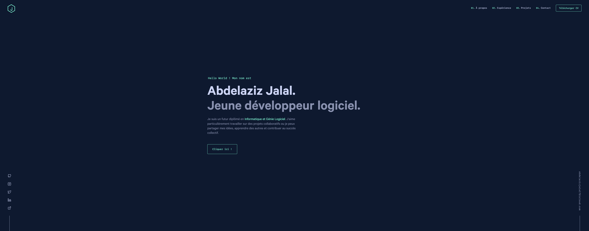

<div align="center">
  
</div>
<h1 align="center">
  Site internet personnel - RelayV1
</h1>
<p align="center">
  Mon premier site internet personnel, détaillant ma bio, mon expérience et mes projets.
</p>
<p align="center">
  Capture d'écran de la page d'accueil :
</p>
<p align="center">
  <a>
    
  </a>
</p>

## 🚨 Informations importantes !

> ### Le template de ce site internet appartient à [Brittany Chiang](https://github.com/bchiang7). J'ai simplement fait les modifications nécessaires pour adapter son site internet à mon expérience, et mon éducation. Je ne suis pas un génie du développement web !

> Veuillez noter que site n'est pas encore terminé. Plusieurs ajustements sont nécessaires pour rendre le site 100% fonctionnel, ainsi que personnalisé.

> Des mises à jours régulières sertont fait très prochainement.

## 🛠 Installation & Set Up

1. Ouvrez votre terminal et exécutez

   ```sh
   git clone https://github.com/bchiang7/v4.git
   ```

2. Installer le Gatsby CLI

   ```sh
   npm install -g gatsby-cli
   ```

3. Installez et utilisez la version correcte de Node en utilisant [NVM](https://github.com/nvm-sh/nvm)

   ```sh
   nvm install
   ```

4. Installez les dependances

   ```sh
   yarn
   ```

5. Démarrez le serveur de développement

   ```sh
   npm start
   ```

## 🚀 Construction and Running pour la Production

1. Générer une version statique de production

   ```sh
   npm run build
   ```

1. Prévisualiser le site tel qu'il apparaîtra une fois déployé

   ```sh
   npm run serve
   ```

## 🎨 Références des couleurs

| Couleur        | Hex                                                                |
| -------------- | ------------------------------------------------------------------ |
| Navy           |  `#0a192f` |
| Light Navy     |  `#112240` |
| Lightest Navy  |  `#233554` |
| Slate          |  `#8892b0` |
| Light Slate    |  `#a8b2d1` |
| Lightest Slate |  `#ccd6f6` |
| White          |  `#e6f1ff` |
| Green          |  `#64ffda` |

## 💰 Credits (english)

> All credits should go to [Brittany Chiang](https://github.com/bchiang7), who is the beast that created this beautiful and dynamic website.

> If you want to see her version of the website, clic [here](https://v4.brittanychiang.com).

> All her socials are either on her webite, or on her [Github Profile](https://github.com/bchiang7).

> Her version of the website is licensed by the [MIT](https://www.mit.edu).

<div align="center">
  
</div>
